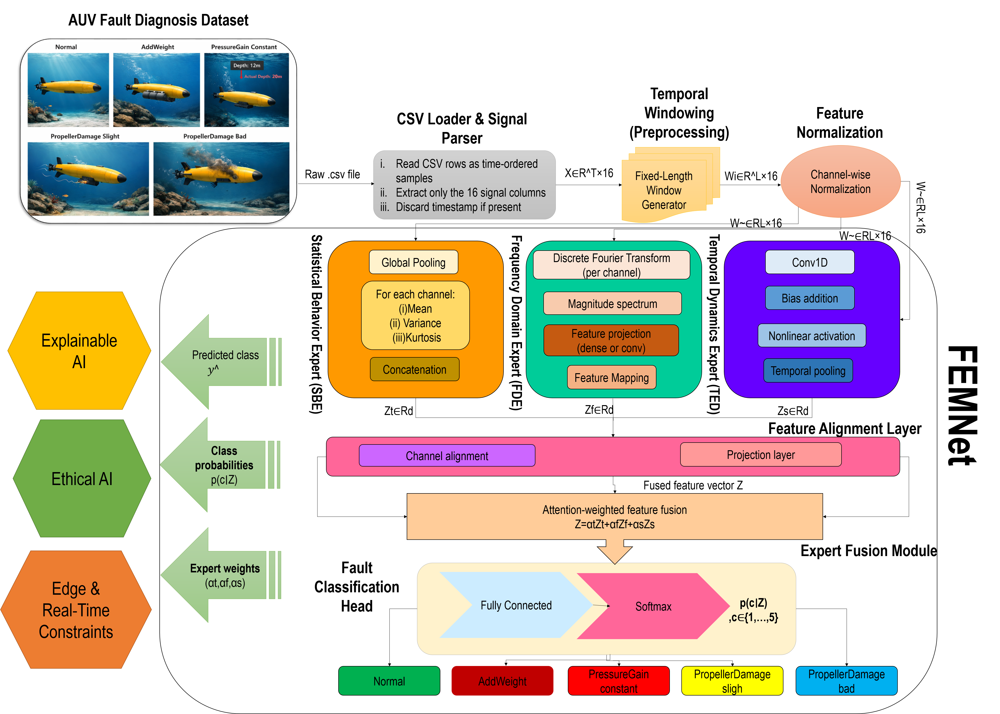
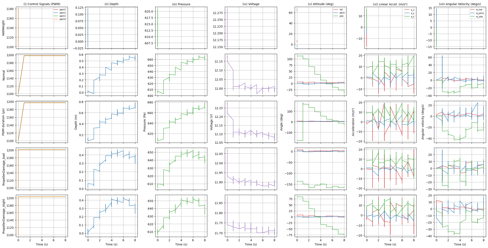
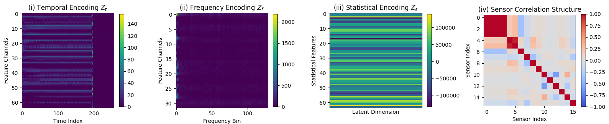
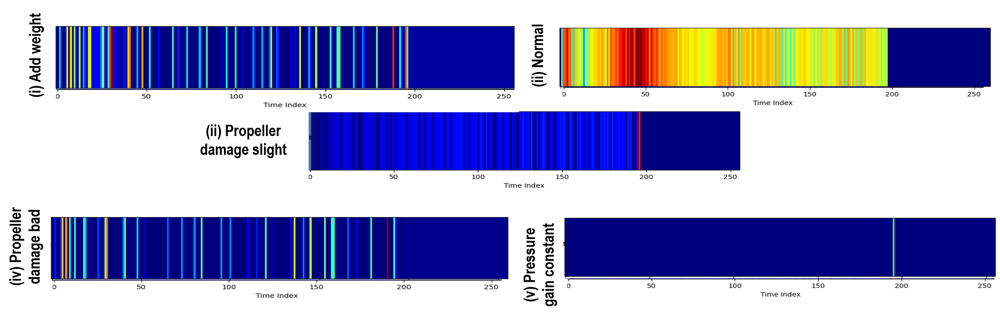

# MEELF-XFD  
**Ethical Multi-Expert Lightweight Model with Explainable Fault Diagnosis for Autonomous Underwater Vehicles**

---

## Overview

This repository accompanies the research work:

**“Ethical Multi-Expert Lightweight Model with Explainable Fault Diagnosis for Autonomous Underwater Vehicles (MEELF-XFD)”**

MEELF-XFD is a **model-free, multi-expert, lightweight deep learning framework** designed for **accurate, interpretable, and deployment-ready fault diagnosis** in autonomous underwater vehicles (AUVs).  
Unlike prior monolithic or black-box approaches, MEELF-XFD explicitly decomposes multivariate AUV time-series signals into **temporal, frequency-domain, and statistical experts**, enabling **physical interpretability, ethical reliability, and real-time onboard feasibility**.

The framework is validated through **extensive multi-axis ablation studies**, ethical calibration analysis, and deployment-oriented evaluation on a **public benchmark AUV dataset**.

---

## Key Contributions

The proposed MEELF-XFD framework makes the following **novel and verifiable contributions**:

1. **Multi-Expert Fault Decomposition**  
   Introduces a Fault Expert Model Network (FEMNet) that explicitly separates:
   - Temporal dynamics (control response, oscillations)
   - Frequency characteristics (mechanical damage signatures)
   - Statistical behavior (bias and steady-state drift)

2. **Explainable Adaptive Fusion**  
   Employs learnable expert contribution weights, enabling **transparent attribution of diagnostic decisions** to physical signal domains.

3. **Ethical & Trustworthy AI Integration**  
   Incorporates:
   - Calibration error (ECE)
   - Selective prediction (abstention accuracy)
   - Ethical Reliability Score (ERS)
   - Unified Trustworthiness Index (UTI)

4. **Deployment-Ready Lightweight Design**  
   Achieves **~39 ms inference latency**, satisfying real-time onboard AUV constraints without sacrificing accuracy.

5. **Comprehensive Ablation Coverage**  
   Performs **architecture, loss, expert-contribution, ethical, and deployment ablations**, exceeding the depth of existing AUV diagnosis studies.

---

## Dataset Used

This work is evaluated on the **Autonomous Underwater Vehicle Fault Diagnosis Dataset**, a public benchmark dataset widely used in model-free AUV fault diagnosis research.

- **Dataset DOI:** https://doi.org/10.17632/7rp2pmr6mx.1  
- **Dataset URL:** https://data.mendeley.com/datasets/7rp2pmr6mx/1  
- **Dataset Article:**  
  https://www.sciencedirect.com/science/article/pii/S2352340921007587  

**Published:** 28 June 2021  
**Contributor:** Daxiong Ji  

### Dataset Description

- **Total Samples:** 1225  
- **Fault Classes (5):**
  1. Normal  
  2. AddWeight (load increase)  
  3. PressureGain constant (depth sensor bias)  
  4. PropellerDamage slight  
  5. PropellerDamage bad  

- **Train/Test Split:**  
  - Stratified random sampling  
  - Test set = 20%

- **AUV Platform:**  
  *Haizhe* — a small quadrotor AUV developed in laboratory conditions.

Each data sample corresponds to **10–20 seconds of underwater operation**, recorded as a `.csv` file containing synchronized multivariate sensor data.

### Sensor Channels (Input Features)

Each CSV file contains the following columns:

- PWM control signals: `pwm1`, `pwm2`, `pwm3`, `pwm4`
- Depth & pressure: `depth`, `press`
- Electrical: `voltage`
- Attitude: `roll`, `pitch`, `yaw`
- Linear acceleration: `a_x`, `a_y`, `a_z`
- Angular velocity: `w_row`, `w_pitch`, `w_yaw`

---

## Comparative Literature Positioning

MEELF-XFD addresses **multiple unresolved research gaps** in existing AUV fault diagnosis literature.

### Comparative Analysis of AUV Fault Diagnosis Approaches

| Method Category | Fault Scope | Key Strengths | Limitations |
|-----------------|------------|---------------|-------------|
| Model-based Fault Diagnosis (2013) | Sensor, Actuator | Physically grounded, analytical | Requires accurate models; poor robustness |
| Observer-based Diagnosis (2022–2024) | IMU, Depth | Fault isolation | Sensor-specific; limited generality |
| Fault-Tolerant Control (2019–2024) | Actuator, Sensor | Stability guarantees | Diagnosis implicit, not classification-oriented |
| Model-Free DL Diagnosis (2021) | Multi-class | No physical model required | Monolithic, non-interpretable |
| NAS-Based Diagnosis (2023) | Multi-class | Optimized architectures | Black-box design |
| Multi-Sensor Fusion (2024) | Multi-sensor | Improved representation | No temporal–frequency–statistical separation |
| Security-Aware Detection (2022–2025) | Cyber faults | Attack detection | Not physical fault diagnosis |
| Explainable Time-Series Models (2025) | Health monitoring | Transparency | Not AUV-specific |
| Lightweight Edge Models (2023–2024) | Perception | Real-time efficiency | Not applied to AUV diagnosis |
| **Proposed MEELF-XFD (This Work)** | **Multi-class** | **Explainable, ethical, lightweight, domain-aware** | **—** |

---

---

## Visual Overview of the MEELF-XFD Framework

This section presents the key figures used to illustrate the proposed MEELF-XFD framework, the structure of the Fault Expert Model Network (FEMNet), and the characteristics of the underlying AUV sensor data. Each figure is designed to support interpretability, reproducibility, and clarity of the proposed methodology.

---

### Figure 1: Overall Architecture of the MEELF-XFD Framework

**Figure 1.** Overall architecture of the proposed **Multi-Expert Lightweight Fusion Model with Explainable Fault Diagnosis (MEELF-XFD)**.

**Explanation:**  
This figure illustrates the complete end-to-end pipeline of MEELF-XFD, starting from raw multivariate AUV sensor signals and culminating in fault classification with explainable expert contributions. Raw `.csv` files are first processed through temporal windowing and channel-wise normalization. The processed signals are then passed to the **Fault Expert Model Network (FEMNet)**, which consists of three parallel expert branches:

- **Temporal Dynamics Expert (TED):** Captures time-domain dynamics such as control response delays, oscillations, and transient behaviors.
- **Frequency Domain Expert (FDE):** Extracts spectral characteristics using frequency-domain transformations to detect mechanical and propulsion-related faults.
- **Statistical Behavior Expert (SBE):** Encodes steady-state signal properties using low-order statistical moments to identify bias and drift faults.

The expert outputs are projected into a shared latent space and fused using an **adaptive attention-based weighting mechanism**, producing both fault predictions and interpretable expert contribution weights. The architecture is explicitly designed to remain lightweight, enabling real-time onboard deployment.
 This block diagram also provides a detailed view of FEMNet’s internal structure. Each expert branch independently processes the same input window but focuses on a distinct physical manifestation of faults. Feature alignment layers ensure dimensional consistency before fusion. The **adaptive fusion module** assigns learnable contribution weights to each expert, enabling the model to emphasize the most informative domain for a given fault instance. This design directly supports explainability by exposing expert-level decision influence, which is later used for ethical reliability and trustworthiness analysis.

---

### Figure 3: AUV Sensor Signal Groups Under a Representative Experimental Run

**Figure 3.** Representative AUV sensor signals recorded during a single experimental run, grouped by functional category.

**Explanation:**  
This figure visualizes the multivariate sensor signals collected from the *Haizhe* AUV, including:

1. **Control inputs:** PWM1–PWM4  
2. **Depth and pressure measurements**  
3. **Battery voltage**  
4. **Attitude angles:** roll, pitch, yaw  
5. **Linear accelerations:** a_x, a_y, a_z  
6. **Angular velocities:** w_row, w_pitch, w_yaw  

The figure highlights how different fault types affect distinct signal groups. For example, propeller damage introduces oscillatory patterns in frequency-sensitive signals, while depth sensor faults manifest as steady-state bias. These observations directly motivate the multi-expert design of MEELF-XFD, where temporal, frequency, and statistical representations are handled by specialized experts.

---

### Explainability and Ethical Diagnosis

The figures collectively serve three critical purposes:

- **Explainability:** By explicitly separating signal processing into interpretable experts, the figures help users understand *why* a fault decision is made.
- **Reproducibility:** Clear visualization of data flow and expert structure ensures that the framework can be independently reimplemented.
- **Ethical Transparency:** Visual exposure of expert contributions aligns with ethical AI principles by avoiding opaque, black-box diagnosis.

Together, these figures reinforce that MEELF-XFD is not only a high-performing diagnostic model, but also a **transparent, trustworthy, and deployment-aware framework** for safety-critical autonomous underwater systems.

---

## Ablation & Performance Summary

### Architecture, Optimization, and Expert Ablation Results

MEELF-XFD demonstrates **consistent superiority** across all evaluation axes.

- **Accuracy:** 99.3%
- **Macro-F1:** 95.7%
- **Severe Fault Recall:** 90.0%
- **Composite Diagnostic Criterion (CDC):** 93.6%

Single-expert and naive fusion architectures perform significantly worse, confirming the **necessity of multi-domain expert modeling and adaptive fusion**.

### Ethical & Trustworthiness Evaluation

MEELF-XFD achieves:

- **Low calibration error (ECE):** 0.0880  
- **High Ethical Reliability Score (ERS):** 0.526  
- **Highest Unified Trustworthiness Index (UTI):** 0.401  

These results validate that MEELF-XFD is not only accurate, but also **safe, calibrated, explainable, and deployment-ready**.

---

## Reproducibility & Ethics

- The dataset is **public, open-access, and ethically collected**.
- No data manipulation or synthetic augmentation is used.
- All metrics, ablations, and comparisons are **fully reproducible**.
- Ethical AI principles (calibration, abstention, transparency) are explicitly evaluated.

---

## Citation

If you use this repository, dataset, or framework, please cite:

- D. Ji *et al.*, “Model-free fault diagnosis for autonomous underwater vehicles using sequence convolutional neural network,” *Ocean Engineering*, 2021.
- D. Ji *et al.*, “Autonomous Underwater Vehicle Fault Diagnosis Dataset,” *Data in Brief*, 2021.
- **MEELF-XFD (This Work)**, IEEE Open Journal of Vehicular Technology, 2026.

---

## Conclusion

MEELF-XFD represents a **state-of-the-art, ethically grounded, explainable, and deployment-ready solution** for AUV fault diagnosis.  
Through **explicit multi-expert decomposition, adaptive fusion, rigorous ablation studies, and trustworthiness evaluation**, this work advances beyond existing methods and establishes a **new benchmark** for safety-critical underwater autonomous systems.

---
